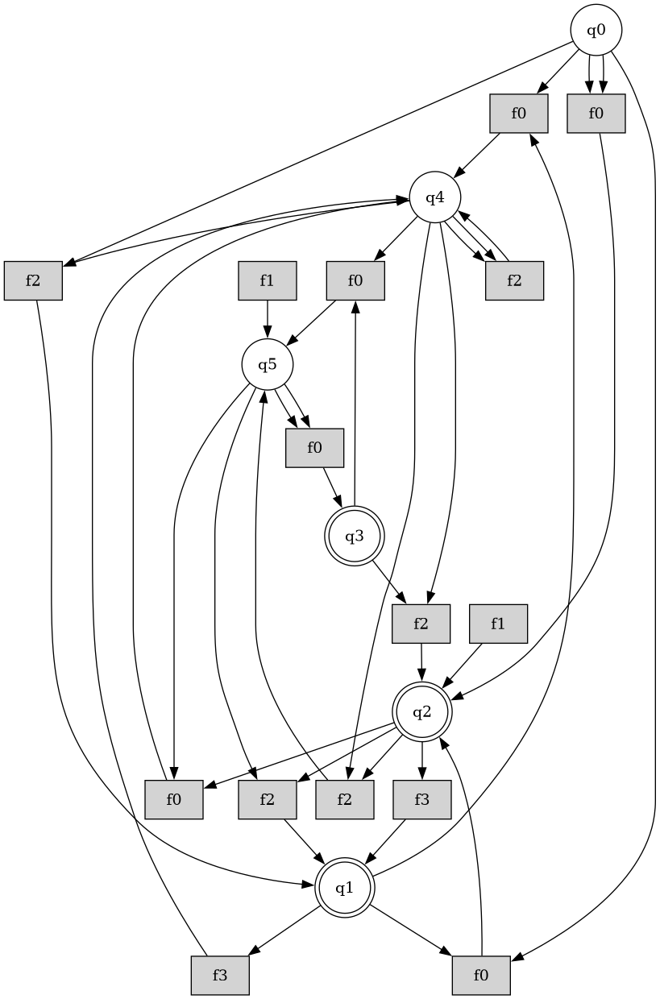

# TARgET
## OVERVIEW

"TARgET: <ins>T</ins>ree <ins>A</ins>utomata and <ins>Reg</ins>ular <ins>E</ins>xpression <ins>T</ins>oolkit is an open-source Python library for the modeling, manipulation, transformation, and analysis of tree automata and related formal models. It provides a unified framework for implementing algorithms from formal language theory, term rewriting, and automata-based verification, while remaining extensible for research and educational purposes.

The library offers a comprehensive collection of data structures and algorithms for constructing and manipulating finite tree automata, regular tree expressions, and term rewriting systems. It includes operations such as automata transformations, language-preserving constructions, reachability analysis, tree transformations, and visualization through Graphviz. These components are designed to facilitate the implementation, experimentation, and evaluation of algorithms commonly encountered in formal methods and program verification.

TARgET emphasizes modularity and extensibility. Its object-oriented architecture enables users to integrate new algorithms, define custom transformations, and extend existing components without modifying the core library. This design makes the library suitable both as a reusable software library for research projects and as a foundation for developing new methods in automata theory and formal verification.

To further assist users, TARgET provides an optional AI-assisted module capable of supporting exploration of the library and generating guidance for available operations. This functionality complements the core library while remaining independent of its primary analysis capabilities.

The project is implemented in Python and is accompanied by comprehensive API documentation, examples, and reproducible Conda environments, making it suitable for research, teaching, and rapid prototyping in areas including tree formal language theory, tree automata, term rewriting, model checking, and software verification.

## FEATURES

TARgET provides a comprehensive framework for working with tree automata and related formal models, including:

- **Comprehensive Framework**
  - Unified Python library for tree automata, term rewriting systems, and related formal models.

- **Extensible Architecture**
  - Modular object-oriented design.
  - Easily implement new automata operations, transformations, analysis algorithms, and data structures.
  - Designed to support research, experimentation, and rapid prototyping.

- **Tree Automata**
  - Construction and manipulation of finite tree automata.
  - Language analysis and automata operations.

- **Term Rewriting**
  - Representation of terms and rewrite rules.
  - Rewriting and reachability analysis.

- **Tree Transformations**
  - Support for implementing and applying transformation algorithms.

- **Visualization**
  - Graphviz-based visualization of automata, trees, and related structures.

- **Documentation and Examples**
  - Comprehensive API documentation and example workflows.

- **AI-Assisted Extensibility**
  - An optional AI assistant designed to facilitate the development of new TARgET modules.
  - Assists contributors in implementing new operations while adhering to the library's architecture and software specifications.
  - Promotes consistency, maintainability, and faster integration of new functionalities into the framework.

## INSTALLATION


TARgET supports multiple installation methods to accommodate different user requirements. The recommended approach is to use one of the provided Conda environments, which ensure that all required dependencies are installed with compatible versions. A standard environment is available for the core library, while an extended environment includes the optional AI assistant and its additional dependencies. Alternatively, TARgET can be installed via `pip`, with optional extras available to enable AI-assisted functionality.

### Conda (Core Library)

Create and activate the Conda environment for the core TARgET library:

```bash
conda env create -f environment.yml
conda activate target
```

### Conda (Library + AI Assistant)

Create and activate the Conda environment including the optional AI assistant:

```bash
conda env create -f environment_ai.yml
conda activate target_ai
```

### pip (Comming soon)

Install the latest release of the core library from PyPI :

```bash
pip install target
```

To install TARgET together with the optional AI assistant and its required dependencies:

```bash
pip install "target[ai]"
```

> **Note**
>
> The AI assistant is an optional component intended to assist contributors and advanced users in extending TARgET. It provides guidance for developing new modules and operations while adhering to the library's architecture, design principles, and implementation specifications. The core functionality of TARgET is fully available without the AI assistant.

### Running the tests

TARgET uses a `src` layout. Install the package in editable mode before running the test suite:

    python -m pip install -e .

Then run:

    python -m pytest


## Quick Start

TARgET is organized into independent packages, each implementing a specific family of formal models, algorithms, or transformations. Every package includes illustrative examples demonstrating its typical usage, allowing users to quickly explore the available functionality and adopt the components most relevant to their applications.

The general workflow when using TARgET consists of:

1. Import the required package(s) and classes.
2. Construct the desired formal objects (e.g., tree automata, regular tree expressions, terms, or rewrite rules).
3. Apply the desired operations or analysis algorithms.
4. Inspect, export, or visualize the resulting structures.

The following template illustrates this workflow:

```python
from TARgET.<package> import ...

# Construct the required formal objects

# Apply one or more TARgET operations

# Process or visualize the results
```

Detailed, executable examples are provided within each package of the library and serve as practical references for their respective APIs and functionalities. Users are encouraged to consult the documentation of the relevant package for complete usage examples and implementation details.


The following examples illustrate some of the core capabilities of TARgET. Additional examples are provided within each package of the library.

### Example 1: Constructing, determinizing and Visualizing a bottom up Finite Ranked Tree Automaton

We can create a bottom up finite ranked tree automaton mannually using

```python
from TARgET.fta.state import State
from TARgET.core.symbol import Ranked_Symbol
from TARgET.fta.rankedRule import ranked_Rule
from TARgET.fta.rankedfta import ranked_Fta

from typing import List

q= State(name="q", is_Final=False)
qg=State(name="qg", is_Final=False)
qf=State(name="qf", is_Final=True)
symb_f = Ranked_Symbol(name="f", rank=2)
symb_a = Ranked_Symbol(name="a", rank=0)
symb_g = Ranked_Symbol(name="g", rank=1)
rule1 = ranked_Rule(func= symb_a, input_states=[], output_state=q)
rule2 = ranked_Rule(func = symb_g, input_states=[q], output_state=qg)
rule3 = ranked_Rule(func = symb_f, input_states=[q, q], output_state=q)
rule4 = ranked_Rule(func = symb_g, input_states=[q], output_state=q)
rule5 = ranked_Rule(func = symb_g, input_states=[qg], output_state=qf)

fta = ranked_Fta(
    fta_states=[q, qg, qf],
    alphabet=[symb_a, symb_g, symb_f],
    transitions=[rule1, rule2, rule3, rule4, rule5]
)
```

or by using random generator:

```python
from TARgET.fta.rankedfta import ranked_Fta
from TARgET.engine.random.ranked_fta_generator import RandomRankedFtaGenerator

generator = RandomRankedFtaGenerator(
n_states=6,
n_symbols=4,
max_rank=2,
n_rules=15,
seed=42
)
random_fta = generator.generate()
random_fta.print_Fta()
```
We apply the determinization algorithm:

```python
from TARgET.engine.fta.determinization.ranked_determinization import determinize
determ_fta = determinize(fta)
determ_fta.print_Fta()
```
And we visualize the resulting DFTA:

```python

from TARgET.engine.fta.drawing.rankedFtaDraw import draw_ranked_fta

dot = draw_ranked_fta(determ_fta)
dot.render("fta1", format="png", cleanup=True) 
```

We got this result for the randomly generated FTA:


### Weighted Regular Tree Expressions

The following example demonstrates how to construct a weighted regular tree expression. The resulting expression can subsequently be manipulated using the operations provided by the library, such as simplification, derivatives, transformations, or conversion algorithms.

```python
from algebric.trop_semiring import TropicalSemiring as TS
from core.symbol import Ranked_Symbol
from TARgET.rte.weighted.weight import Weight

f= Ranked_Symbol('f', rank = 2)
a = Ranked_Symbol('a')
b= Ranked_Symbol('b')
E = Weight(TS(1.0), Weight(TS(2.0),Plus(function(f, [Atom(a), Atom(b)]), function(f, [Atom(b), Atom(a)]))))
print("The weighted expression", E)   # The weighted expression 𝕋(1.0) ⊗ (𝕋(2.0) ⊗ (f(a,b) + f(b,a)))
W = SemiringRteWeighting(TS)
print("The total weight is" , W.weight(E))   # 𝕋(3.0)
```

## DOCUMENTATION

TARgET is accompanied by comprehensive API documentation covering all packages, classes, methods, and modules included in the library. The documentation is automatically generated from the source code and its docstrings, ensuring that it remains synchronized with the implementation.

In addition to the API reference, each package provides illustrative examples demonstrating the use of its main components and algorithms.

The documentation can be generated locally using:

```bash
pydoctor --make-html --html-output docs TARgET
```

The generated HTML documentation will be available in the `docs/` directory and can be opened in any modern web browser.

The actualized documentation is available at <yanos84.github.io/TARgET>


## CITATION

If you use TARgET in your research, please cite the accompanying article once it becomes available. Citation information, including the DOI and BibTeX entry, will be added to this repository upon publication.

Until then, please cite the TARgET repository if you reference the library in academic work.

## CONTRIBUTING

Contributions to TARgET are welcome. The library has been designed as a modular and extensible framework, allowing researchers and developers to implement new formal models, algorithms, and analysis techniques while preserving consistency with the existing architecture.

Contributors are encouraged to follow the project's coding conventions and documentation practices. The optional AI assistant can assist in the development of new modules by providing guidance aligned with TARgET's architecture, implementation patterns, and software specifications.

Bug reports, feature requests, and pull requests are welcome through the project's GitHub repository.


## LICENCE

TARgET is released under the Apache License 2.0. See the `LICENSE` file for the complete license terms and conditions.

